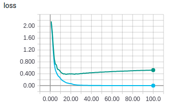
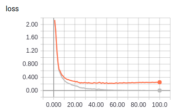
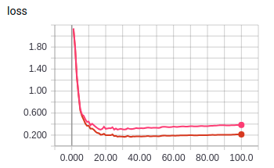
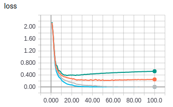

# Prioritized experience replay in supervised learning
PER is one of the most important components of [Rainbow DQN](https://arxiv.org/pdf/1710.02298.pdf) and was also suggested to be used in supervised learning in
the [original paper](https://arxiv.org/pdf/1511.05952.pdf). The paper indicates
faster learning speed and greater generalization but dit not make an exhaustive investigation.

Importance sampling of mini-batches was also investigated in
[this paper](https://arxiv.org/pdf/1602.02283.pdf) and shows that it increases
learning speed.

However, despite the benefits of this approach it has not been adopted widely in supervised learning maybe due to implementation issues in current frameworks
like pytorch and tensorflow. _The data loaders in pytorch have not been made
with this purpose in mind._

This is a quick minimal experiment with the focus of investigating
PER/importance sampling in supervised learning.

## Problem setup
MNIST standard pytorch example as base and decrease the number of training
examples to only 500 or the problem is too easy.

## Results

1. Standard random sampling without replacement

2. Importance sampling with replacement

3. Uniform sampling with replacement

4. Compare standard and importance sampling

On this small and relatively simple task of MNIST, any speedups are not obvious
(rather it could be the other way around) but generalization might be better.
This is consistent with results on other smaller problems where I have tried PER.
